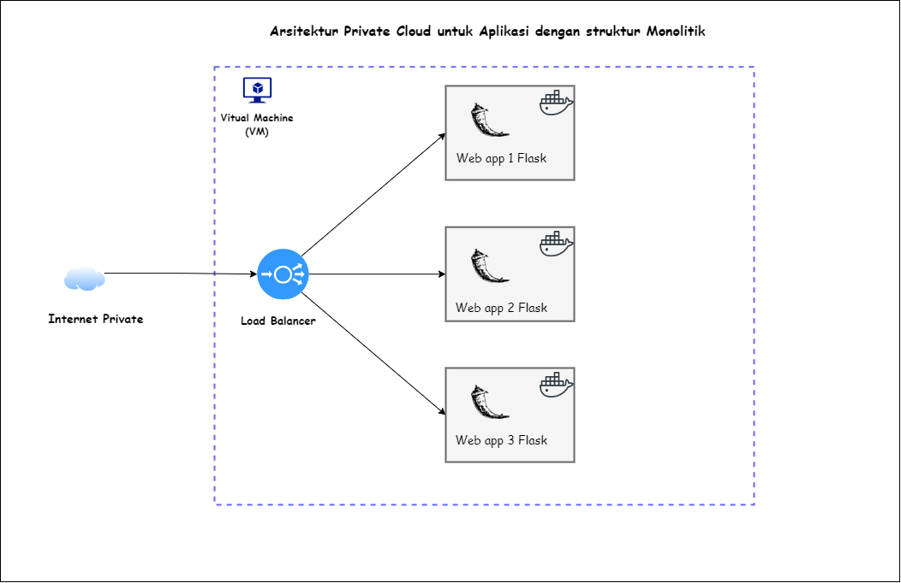

## Arsitektur 



Cara membangun dan menjalankan load balancer Nginx dengan teknik round-robin dan aplikasi monolitik menggunakan Flask dalam Docker:

```markdown
# Nginx Load Balancer with Round Robin

Proyek ini menunjukkan cara mengatur Nginx sebagai load balancer menggunakan metode distribusi **round-robin** untuk mendistribusikan trafik secara merata di antara tiga aplikasi monolitik berbasis Flask.

## Struktur Direktori Proyek

Struktur proyek ini mengatur aplikasi Flask monolitik yang di-load balance oleh Nginx menggunakan Docker dan Docker Compose.

```
/home/ubuntu/nginx_load_banlancer/
├── app1/
│   ├── Dockerfile            # Dockerfile untuk membangun app1
│   ├── app1.py               # Kode aplikasi Flask app1
│   └── requirements.txt      # Dependensi untuk app1
├── app2/
│   ├── Dockerfile            # Dockerfile untuk membangun app2
│   ├── app2.py               # Kode aplikasi Flask app2
│   └── requirements.txt      # Dependensi untuk app2
├── app3/
│   ├── Dockerfile            # Dockerfile untuk membangun app3
│   ├── app3.py               # Kode aplikasi Flask app3
│   └── requirements.txt      # Dependensi untuk app3
├── nginx/
│   ├── Dockerfile            # Dockerfile untuk membangun Nginx sebagai load balancer
│   └── nginx.conf            # Konfigurasi Nginx untuk load balancing
└── docker-compose.yaml       # Konfigurasi Docker Compose untuk menjalankan semua layanan
```

## Konfigurasi Aplikasi

Setiap aplikasi (`app1`, `app2`, `app3`) adalah aplikasi Flask sederhana yang berjalan di dalam kontainer Docker.

### `app1.py`, `app2.py`, dan `app3.py`
```python
from flask import Flask

app1 = Flask(__name__)

@app1.route('/')
def hello_world():
    return 'Hi, this is App 1'

if __name__ == '__main__':
    app1.run(debug=True, host='0.0.0.0')
````

### `requirements.txt`

```plaintext
Flask==2.0.1
MarkupSafe==2.0.1
```

### `Dockerfile` untuk `app1`, `app2`, `app3`

```dockerfile
# Gunakan image dasar Python 3.8
FROM python:3.8

# Salin file requirements.txt ke dalam container
COPY requirements.txt /requirements.txt

# Set direktori kerja
WORKDIR /app

# Install dependensi
RUN pip install --no-cache-dir -r /requirements.txt

# Salin kode aplikasi ke dalam container
COPY . /app

# Tentukan perintah untuk menjalankan aplikasi
ENTRYPOINT ["python3"]
CMD ["app1.py"]
```

## Konfigurasi Nginx

Nginx berfungsi sebagai load balancer yang menggunakan metode **round-robin** untuk mendistribusikan trafik ke `app1`, `app2`, dan `app3`.

### `nginx.conf`

```nginx
events {
    worker_connections 1024;
}

http {
    upstream loadbalancer {
        server app1:5000;
        server app2:5000;
        server app3:5000;
    }

    server {
        listen 80;

        location / {
            proxy_pass http://loadbalancer;
            proxy_set_header Host $host;
            proxy_set_header X-Real-IP $remote_addr;
            proxy_set_header X-Forwarded-For $proxy_add_x_forwarded_for;
            proxy_set_header X-Forwarded-Proto $scheme;
        }
    }
}
```

### `Dockerfile` untuk Nginx

```dockerfile
FROM nginx:latest
COPY nginx.conf /etc/nginx/nginx.conf
```

## Docker Compose Setup

File `docker-compose.yaml` digunakan untuk mengatur dan menjalankan semua layanan (tiga aplikasi dan Nginx load balancer).

### `docker-compose.yaml`

```yaml
version: "3"
services:
  app1:
    build: ./app1
    ports:
      - "5001:5000"

  app2:
    build: ./app2
    ports:
      - "5002:5000"

  app3:
    build: ./app3
    ports:
      - "5003:5000"

  nginx:
    build: ./nginx
    ports:
      - "8080:80"
    depends_on:
      - app1
      - app2
      - app3
```

## Cara Menjalankan Proyek

1. **Clone Repositori**

   ```bash
   git clone https://github.com/endrycofr/Loadbalancer-nginx.git
   cd Loadbalancer-nginx
   ```

2. **Build dan Jalankan Kontainer**
   Jalankan perintah berikut untuk membangun dan menjalankan aplikasi menggunakan Docker Compose:

   ```bash
   docker-compose up --build
   ```

3. **Akses Load Balancer**
   Akses load balancer melalui browser di `http://localhost:8080`. Nginx akan mendistribusikan request ke aplikasi `app1`, `app2`, dan `app3` secara bergantian menggunakan teknik **round-robin**.

4. **Menghapus Semua Image Docker**
   Jika kamu ingin menghapus semua image Docker yang ada, gunakan perintah berikut:
   ```bash
   docker rmi -f $(docker images -q)
   ```

## Penjelasan Round Robin

Dengan metode **round-robin**, Nginx memastikan setiap request dibagi secara merata ke semua aplikasi backend (`app1`, `app2`, dan `app3`). Hal ini memastikan bahwa beban ditangani secara efisien, memberikan ketersediaan dan respons yang lebih baik untuk setiap aplikasi.

## Kesimpulan

Dengan menggunakan Docker dan Nginx sebagai load balancer dengan teknik distribusi **round-robin**, aplikasi monolitik dapat berjalan lebih efisien, dan trafik dapat dikelola secara merata untuk memastikan performa optimal.

```

```
